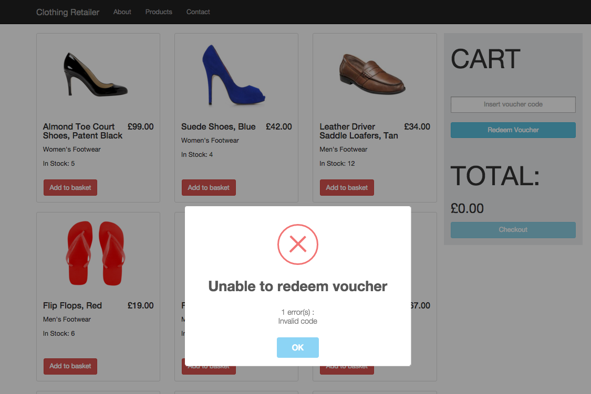

## Technologies Used
The project is built primarily in Angular, with configuration based on the angular-seed project.

Third party libraries such as Bootstrap have been used to aid the user experience.



## Getting Started (for Mac)
Close the repository using git (downloadable at http://git-scm.com/):

```git clone https://github.com/Alaanzr/clothing_retailer.git ```

### Installing dependencies

The node package manager (npm) houses the back-end dependencies for this project, and a script has been preconfigured to install  front-end dependencies off the back of npm.

To get started therefore, simply type:
```npm install```

You should subsequently find the node_modules and app/bower_components folders in the project directory.


### Running the application
The project utilises the npm's http-server. To start the development web server, type the following:
```npm start```

You can then browse to the application's index page at ```http://localhost:8000/app/index.html```

## Testing

### Running Unit tests

The unit tests for this project have been written in Jasmine and run on the Karma test runner. To run these tests using another preconfigured script, type:

```npm test```

NOTE: All scripts can be found in the package.json file within the project directory.

Karma will continue to run using the above method, so you may wish to carry out a single run of the tests and exit the test runner. To execute a single run:

```npm run test-single-run```

### Running end to end tests

End-to-end tests have also been written in Jasmine and utilise the Protractor test runner. Protractor simulates interaction with the app and verifies that it is responding correctly. Therefore, the web server needs to be serving up the application in order for Protractor to interact with it.

Prior to running end-to-end tests therefore, load up the application server:

```npm start```

Protractor is built upon WebDriver and therefore is dependent on its installation. Please ensure that the stand-alone WebDriver tool is downloaded using the below preconfigured script:

```npm run update-webdriver```

Once the above steps have been carried out, type the below to run the end-to-end tests:

```npm run protractor```

The script will execute the tests against the application being hosted on the development server. As the testing simulates interaction with the application, you may experience minor delays

## Directory Layout

```

app ------------------------> Source files for the application
  css ----------------------> Stores Additional stylesheets
    style.css
  img ----------------------> Stores public images
  items
    items.json -------------> Contains product data (utilised in place of a database)
  js
    app.js -----------------> Main application module
    discountService.js -----> Service for calculating discounts
    itemService.js ---------> Service for retrieving product data
    mainController.js ------> Main controller
  index.html ---------------> Application layout file (currently the only html file, i.e. there is no partials folder)
test
  e2e ----------------------> Houses end-to-end tests
    appFeatures.js
  unit ---------------------> Unit tests
    discountService.spec.js
    itemService.spec.js
    mainController.spec.js
  karma-conf.js ------------> Config file for running unit tests with Karma
  protractor-conf.js -------> Config file for running end-to-end tests
.bowerrc -------------------> Config file with instructions for installing bower_components
bower.json -----------------> Bower config file
package.json ---------------> npm config file
```

## My Approach
For this project, the SOLID principles were at the forefront of my mind. Although the spec given for the creation of the application was limited in terms of functionality, I knew that flexible code was key to making the application easily extensible and efficient.

Given the above, I attempted to extract data-centric information out of my controller and into external Services. Services were built for retrieving product data and for calculating discounts; in particular, the Discount factory has been crafted with extensibility in mind (additional voucher codes need only be added to the existing object with conditions and discount numbers specified).

On the front-end, I opted to use Bootstrap to achieve a responsive design. I also decided that, given that there was no scope for building a checkout page for this project, that item quantities would be reduced when added to a user's cart. On that note, please be aware that the navigational items and checkout button are simply for aesthetic purposes and serve no function.

Best practices were followed in line with the Angular styleguide (https://github.com/johnpapa/angular-styleguide). More specifically, Immediately Invoked Function Expressions (IIFEs) were applied to remove variables from the global scope, helping to avoid variable collisions by providing variable scope for each file.

In the first iteration of this project I opted to use the ```controller with $scope``` syntax, however have since moved to the ```controllerAs``` syntax. This helps avoid having to use $parent calls in Views with nested controllers and helps avoid the temptation of using $scope methods inside a controller when it may otherwise be better to avoid them or move the method to a factory.

## Voucher Codes
FIVE

TEN

FIFTEEN
